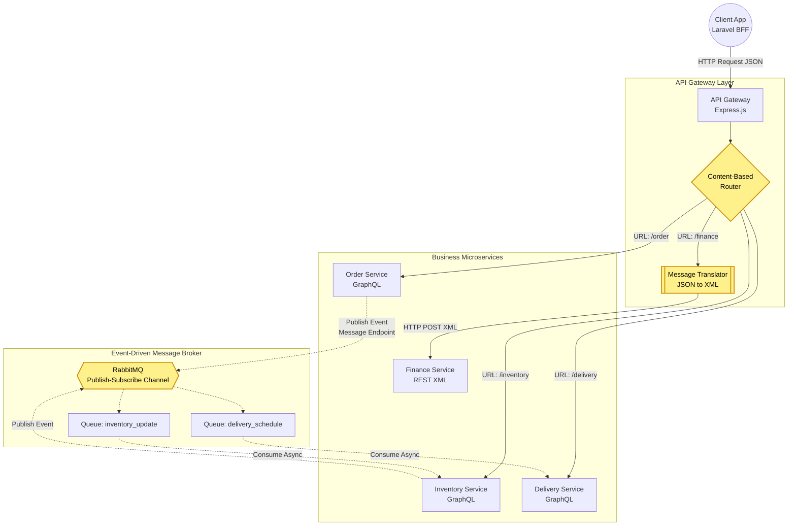

# Arsitektur Integrasi & Pola EIP (SIDAGAS)

Dokumen ini mendeskripsikan topologi sistem, alur pesan antar komponen, serta memetakan pola **Enterprise Integration Patterns (EIP)** yang diimplementasikan untuk menyelesaikan masalah komunikasi antar sistem yang beraneka ragam di SIDAGAS.

---

## 1. Diagram Arsitektur Integrasi Visual

Berikut adalah diagram arsitektur yang menggunakan notasi grafis (di-_render_ dengan Mermaid) untuk menunjukkan sistem, *broker*, *adapter*, aliran pesan, serta label spesifik pola integrasi yang digunakan.

---

## 2. Penjelasan Pola EIP yang Diterapkan

Integrasi sistem berskala _Enterprise_ menuntut penyelesaian atas perbedaan tipe data, kecepatan sistem, dan jenis koneksi. Kami menyelesaikan hambatan tersebut dengan pola-pola berikut:

### A. Content-Based Router (CBR)
**Lokasi:** API Gateway (Node.js)  
**Tujuan:** Mengarahkan pesan ke penerima yang tepat berdasarkan _logical path_.  
**Alur:** Gateway menerima *request* masuk di port `3000`. Ia menganalisa URL (konten tujuan) lalu memutuskan apakah lalu-lintas itu harus dikirim ke *Order Service* (Port 3001) atau *Delivery Service* (Port 3003). Ini mencegah setiap layanan untuk perlu tahu alamat fisik satu sama lain.

### B. Message Translator
**Lokasi:** API Gateway (Node.js Adapter Module)  
**Tujuan:** Mengatasi masalah *Heterogenitas Data* antara sistem modern (JSON) dan sistem _Legacy_ (XML).  
**Alur:** *Finance Service* dirancang murni sebagai _Legacy System_ yang kaku dan hanya menerima instruksi berbasis XML. API Gateway mencegat *payload* dari klien (JSON), mengekstrak nilainya (OrderID, Amount, Method), membangun *tree* XML, dan meneruskannya (POST) ke *Finance Service*.

### C. Publish-Subscribe Channel
**Lokasi:** RabbitMQ Broker  
**Tujuan:** Menerapkan komunikasi asinkron *one-to-many* untuk mencegah *tight-coupling* antar layanan.  
**Alur:** Saat pelanggan memesan galon, sistem tidak secara sinkron menunggu stok terpotong. *Order Service* (sebagai *Publisher*) melemparkan pesan `order.created` ke dalam kanal RabbitMQ lalu langsung mengembalikan respon *Success* ke pengguna. Layanan lain (seperti *Inventory*) diam-diam mendengarkan kanal ini (sebagai *Subscriber*) dan akan memotong stok saat pesanan masuk, memisahkan beban kerja dan memastikan tidak ada yang terhambat.

### D. Message Endpoint
**Lokasi:** Order Service & Inventory Service (Module `amqplib`)  
**Tujuan:** Menyembunyikan kompleksitas protokol komunikasi AMQP dari kode bisnis utama (*Business Logic*).  
**Alur:** Layanan-layanan ini memiliki modul spesifik (*adapter/endpoint*) yang bertugas membuka koneksi AMQP ke RabbitMQ, mendefinisikan *Queue*, dan menerjemahkan _Domain Object_ (Objek Pesanan) menjadi *Byte Stream* pesan asinkron agar aman ditransmisikan.

---
*Diagram di atas secara otomatis dapat dirender menggunakan ekstensi Markdown Preview Mermaid Support.*
