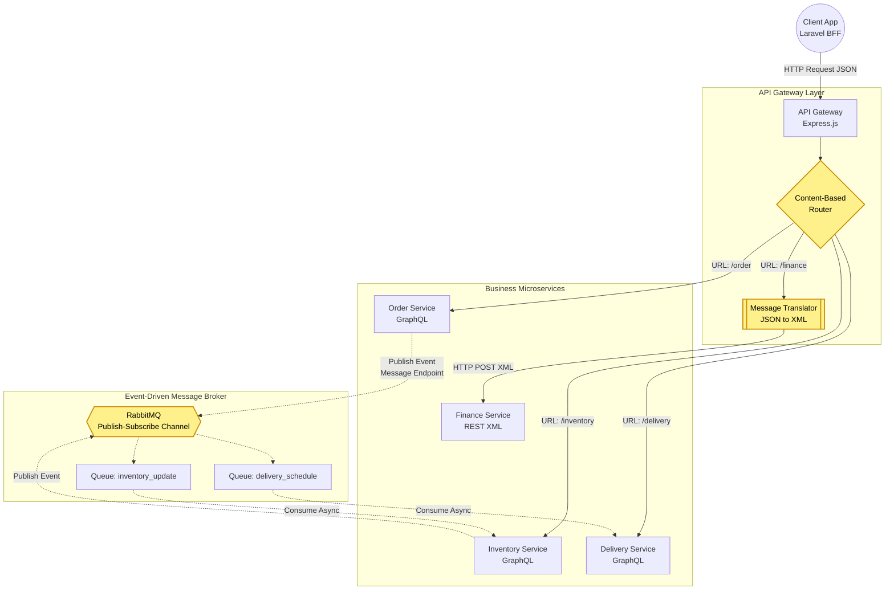
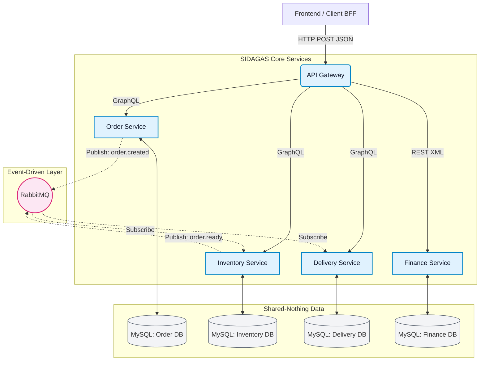

# Arsitektur Integrasi & Pola EIP (SIDAGAS)

Dokumen ini mendeskripsikan topologi sistem, alur pesan antar komponen, serta memetakan pola **Enterprise Integration Patterns (EIP)** yang diimplementasikan untuk menyelesaikan masalah komunikasi antar sistem yang beraneka ragam di SIDAGAS.

---

## 1. Diagram Arsitektur Integrasi Microservice

Berikut adalah diagram arsitektur yang menggunakan notasi grafis (di-_render_ dengan Mermaid) untuk menunjukkan sistem, _broker_, _adapter_, aliran pesan, serta label spesifik pola integrasi yang digunakan.

---

### Penjelasan Pola EIP yang Diterapkan

Integrasi sistem berskala _Enterprise_ menuntut penyelesaian atas perbedaan tipe data, kecepatan sistem, dan jenis koneksi. Kami menyelesaikan hambatan tersebut dengan pola-pola berikut:

### A. Content-Based Router (CBR)

**Lokasi:** API Gateway (Node.js)  
**Tujuan:** Mengarahkan pesan ke penerima yang tepat berdasarkan _logical path_.  
**Alur:** Gateway menerima _request_ masuk di port `3000`. Ia menganalisa URL (konten tujuan) lalu memutuskan apakah lalu-lintas itu harus dikirim ke _Order Service_ (Port 3001) atau _Delivery Service_ (Port 3003). Ini mencegah setiap layanan untuk perlu tahu alamat fisik satu sama lain.

### B. Message Translator

**Lokasi:** API Gateway (Node.js Adapter Module)  
**Tujuan:** Mengatasi masalah _Heterogenitas Data_ antara sistem modern (JSON) dan sistem _Legacy_ (XML).  
**Alur:** _Finance Service_ dirancang murni sebagai _Legacy System_ yang kaku dan hanya menerima instruksi berbasis XML. API Gateway mencegat _payload_ dari klien (JSON), mengekstrak nilainya (OrderID, Amount, Method), membangun _tree_ XML, dan meneruskannya (POST) ke _Finance Service_.

### C. Publish-Subscribe Channel

**Lokasi:** RabbitMQ Broker  
**Tujuan:** Menerapkan komunikasi asinkron _one-to-many_ untuk mencegah _tight-coupling_ antar layanan.  
**Alur:** Saat pelanggan memesan galon, sistem tidak secara sinkron menunggu stok terpotong. _Order Service_ (sebagai _Publisher_) melemparkan pesan `order.created` ke dalam kanal RabbitMQ lalu langsung mengembalikan respon _Success_ ke pengguna. Layanan lain (seperti _Inventory_) diam-diam mendengarkan kanal ini (sebagai _Subscriber_) dan akan memotong stok saat pesanan masuk, memisahkan beban kerja dan memastikan tidak ada yang terhambat.

### D. Message Endpoint

**Lokasi:** Order Service & Inventory Service (Module `amqplib`)  
**Tujuan:** Menyembunyikan kompleksitas protokol komunikasi AMQP dari kode bisnis utama (_Business Logic_).  
**Alur:** Layanan-layanan ini memiliki modul spesifik (_adapter/endpoint_) yang bertugas membuka koneksi AMQP ke RabbitMQ, mendefinisikan _Queue_, dan menerjemahkan _Domain Object_ (Objek Pesanan) menjadi _Byte Stream_ pesan asinkron agar aman ditransmisikan.

---

## 2. Diagram Arsitektur Integrasi Sistem dari Client (BFF)

Berikut adalah diagram alur integrasi sistem dari Client (BFF) hingga ke database masing-masing layanan:

### Enterprise Integration Patterns (EIP) yang Diterapkan:

1. **Content-Based Router:** API Gateway mengarahkan _request_ ke layanan yang tepat berdasarkan _path_ URL (`/order`, `/inventory`, `/finance`).
2. **Message Translator:** API Gateway secara dinamis mengonversi payload JSON dari klien menjadi format XML sebelum meneruskannya ke _Finance Service_ untuk mendemonstrasikan penyelesaian masalah heterogenitas data.
3. **Message Endpoint & Publish-Subscribe Channel:** Layanan berkomunikasi secara asinkron via RabbitMQ. _Order Service_ bertindak sebagai _Publisher_, sedangkan _Inventory_ bertindak sebagai _Subscriber_ sekaligus _Publisher_ ke antrean berikutnya.

---

_Diagram di atas secara otomatis dapat dirender menggunakan ekstensi Markdown Preview Mermaid Support._
