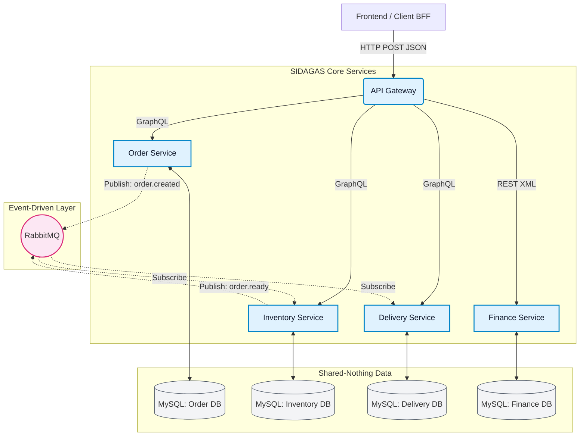

# SIDAGAS: Sistem Informasi Dagang (Microservices Architecture)

SIDAGAS adalah platform terintegrasi untuk manajemen pesanan, inventaris, pengiriman, dan keuangan dalam industri air minum (galon) dan gas LPG. Proyek ini dibangun sebagai implementasi akhir dari mata kuliah **Enterprise Application Integration (EAI)**.

Sistem ini mengadopsi arsitektur **Microservices** yang fully-dockerized, digerakkan oleh event (Event-Driven) menggunakan RabbitMQ, dan menerapkan pendekatan pola integrasi (Enterprise Integration Patterns).

---

## 🏗️ 1. Arsitektur Proyek & Desain Sistem

Sistem dipecah menjadi beberapa layanan kecil yang mandiri (Shared-Nothing Architecture) di mana setiap layanan memiliki database dan *domain logic*-nya sendiri. Sebuah **API Gateway** bertindak sebagai titik masuk tunggal (Single Entry Point) bagi Client (seperti Frontend Laravel/Vue/React).

### Diagram Arsitektur (Mermaid)



### Enterprise Integration Patterns (EIP) yang Diterapkan:
1. **Content-Based Router:** API Gateway mengarahkan *request* ke layanan yang tepat berdasarkan *path* URL (`/order`, `/inventory`, `/finance`).
2. **Message Translator:** API Gateway secara dinamis mengonversi payload JSON dari klien menjadi format XML sebelum meneruskannya ke *Finance Service* untuk mendemonstrasikan penyelesaian masalah heterogenitas data.
3. **Message Endpoint & Publish-Subscribe Channel:** Layanan berkomunikasi secara asinkron via RabbitMQ. *Order Service* bertindak sebagai *Publisher*, sedangkan *Inventory* bertindak sebagai *Subscriber* sekaligus *Publisher* ke antrean berikutnya.

---

## ⚡ 2. Implementasi GraphQL

Berbeda dengan REST tradisional yang rentan terhadap *over-fetching* atau *under-fetching*, layanan Order, Inventory, dan Delivery menggunakan **GraphQL** (via `express-graphql` dan `graphql`).

### Mengapa GraphQL?
- Klien (seperti Dashboard Admin atau App Driver) dapat meminta data secara spesifik. Misalnya, Driver hanya butuh `id` dan `alamat`, sementara Admin butuh seluruh field transaksi. Klien cukup menyesuaikan *Query*-nya tanpa mengubah kode di backend.

### Contoh Kasus (Lengkap):

**1. Query (Mengambil Data)**
Klien hanya ingin mengetahui nama pelanggan dan status pesanan:
```graphql
query {
  getOrders {
    customer_name
    status
  }
}
```
*Respons JSON dari Server:*
```json
{
  "data": {
    "getOrders": [
      { "customer_name": "Budi", "status": "pending" },
      { "customer_name": "Siti", "status": "completed" }
    ]
  }
}
```

**2. Mutation (Memodifikasi Data)**
Klien membuat pesanan baru:
```graphql
mutation {
  createOrder(customer_name: "Ahmad", item_name: "Galon Aqua", quantity: 2) {
    id
    status
  }
}
```
*(Saat mutasi ini berhasil, Order Service secara otomatis melempar pesan ke RabbitMQ yang akan memicu Inventory Service memotong stok).*

---

## 🐳 3. Implementasi Docker

Sistem ini dikemas menggunakan **Docker** dan **Docker Compose** agar siap dijalankan (*production-ready*) tanpa perlu pusing memikirkan konfigurasi environment lokal (*"It works on my machine" problem*).

### Struktur Container

File `docker-compose.yml` mengorkestrasi 10 buah kontainer yang saling terhubung dalam satu jaringan virtual bernama `eai_uas_default`:

| Layanan | Image | Port Host (Mapping) | Fungsi |
|---|---|---|---|
| **api-gateway** | Node.js (Built) | `3000` | Entry point utama / Router / Translator |
| **order-service** | Node.js (Built) | `3001` | Mengatur GraphQL & Menerbitkan Event |
| **inventory-service** | Node.js (Built) | `3002` | Mengelola stok pabrik |
| **delivery-service** | Node.js (Built) | `3003` | Mengelola pengiriman driver |
| **finance-service** | Node.js (Built) | `3004` | Verifikasi pembayaran via XML REST API |
| **rabbitmq** | `rabbitmq:3-management`| `5672` (AMQP), `15672` (UI)| Message Broker untuk komunikasi asinkron |
| **order-db** | `mysql:8.0` | `33061` | Penyimpanan persisten (Volume) Order |
| **inventory-db** | `mysql:8.0` | `33062` | Penyimpanan persisten (Volume) Inventory |
| **delivery-db** | `mysql:8.0` | `33063` | Penyimpanan persisten (Volume) Delivery |
| **finance-db** | `mysql:8.0` | `33064` | Penyimpanan persisten (Volume) Finance |

### Fitur Docker Canggih yang Digunakan:
1. **Depends_On & Healthcheck:** Kontainer Microservices diatur agar baru menyala setelah RabbitMQ benar-benar sehat (*healthy*) dan port database terbuka.
2. **Docker Volumes:** Setiap database MySQL diberi `volume` (misal: `eai_uas_order_db_data`) agar ketika komputer direstart, data pesanan dan stok galon tidak hilang.
3. **Environment Variables:** Keamanan dijaga di mana password database (*MYSQL_ROOT_PASSWORD*) tidak ditulis *hardcode* di dalam kode JS, melainkan di-*inject* melalui file `.env`.

---

## 🚀 4. Cara Menjalankan (*Quick Start*)

1. Pastikan **Docker Desktop** menyala.
2. Buka terminal di folder proyek ini (`E:\SIDAGAS\EAI_UAS`).
3. Jalankan perintah:
   ```bash
   docker compose up --build -d
   ```
4. Tunggu beberapa saat untuk inisialisasi awal database (hanya saat pertama kali).
5. **Verifikasi:**
   - Akses API Gateway: `http://localhost:3000`
   - Akses UI RabbitMQ: `http://localhost:15672` (guest/guest)
   - Buka Database GUI Client (seperti DBeaver atau MySQL Workbench) di localhost port `33061` hingga `33064`.

*(Untuk antarmuka grafis pengguna, Anda bisa menjalankan proyek Laravel di folder Backend).*
