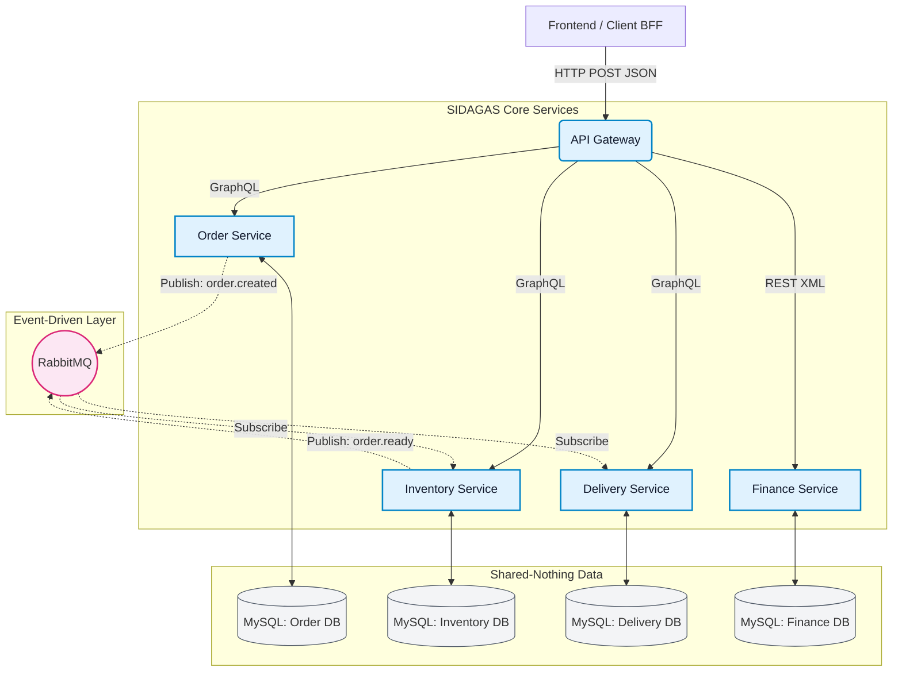

# 💧 SIDAGAS (Sistem Informasi Dagang)
**Enterprise Application Integration (EAI) - Tugas Besar**

---

## 📖 Deskripsi Proyek
**SIDAGAS** adalah sebuah platform sistem informasi manajemen distribusi air minum (galon) dan gas LPG. Proyek ini dibangun khusus untuk memenuhi kriteria arsitektur **Enterprise Application Integration (EAI)**. 

Bukannya menggunakan satu aplikasi besar yang lambat (Monolitik), SIDAGAS memecah berbagai logika bisnis menjadi layanan-layanan kecil yang mandiri (**Microservices**). Proyek ini menunjukkan integrasi skala *Enterprise* di mana sistem-sistem yang berbeda bahasa komunikasi (GraphQL vs REST) dan format data (JSON vs XML) dapat saling bertukar informasi secara lancar melalui sebuah **API Gateway** dan jalur pesan asinkron menggunakan **RabbitMQ**.

---

### Diagram Arsitektur (Mermaid)



### Enterprise Integration Patterns (EIP) yang Diterapkan:
1. **Content-Based Router:** API Gateway mengarahkan *request* ke layanan yang tepat berdasarkan *path* URL (`/order`, `/inventory`, `/finance`).
2. **Message Translator:** API Gateway secara dinamis mengonversi payload JSON dari klien menjadi format XML sebelum meneruskannya ke *Finance Service* untuk mendemonstrasikan penyelesaian masalah heterogenitas data.
3. **Message Endpoint & Publish-Subscribe Channel:** Layanan berkomunikasi secara asinkron via RabbitMQ. *Order Service* bertindak sebagai *Publisher*, sedangkan *Inventory* bertindak sebagai *Subscriber* sekaligus *Publisher* ke antrean berikutnya.

---

## 🏗️ Daftar Sistem & Endpoint

Seluruh sistem di- _hosting_ di kontainer Docker terpisah. Berikut adalah daftar komponen yang beroperasi dalam ekosistem SIDAGAS:

| Nama Layanan | Port Internal | Port Host | Endpoint Utama | Deskripsi |
|---|---|---|---|---|
| **API Gateway** | `3000` | `3000` | `http://localhost:3000/*` | Entry point utama (Router). Semua *client* menembak ke sini. |
| **Order Service** | `3001` | `3001` | `http://localhost:3001/graphql` | Mengurus pembuatan transaksi & pesanan masuk. |
| **Inventory Service**| `3002` | `3002` | `http://localhost:3002/graphql` | Mengelola sisa stok galon/gas dan *intake* barang produksi. |
| **Delivery Service** | `3003` | `3003` | `http://localhost:3003/graphql` | Mengelola data pengiriman, jadwal armada, dan status kurir. |
| **Finance Service** | `3004` | `3004` | `http://localhost:3004/verify` | Menerima dan memverifikasi laporan pembayaran dari transaksi. |
| **RabbitMQ** | `5672` | `5672` / `15672`| `amqp://localhost:5672` | *Message Broker* untuk komunikasi sistem asinkron. |

---

### Struktur Container

File `docker-compose.yml` mengorkestrasi 10 buah kontainer yang saling terhubung dalam satu jaringan virtual bernama `eai_uas_default`:

| Layanan | Image | Port Host (Mapping) | Fungsi |
|---|---|---|---|
| **api-gateway** | Node.js (Built) | `3000` | Entry point utama / Router / Translator |
| **order-service** | Node.js (Built) | `3001` | Mengatur GraphQL & Menerbitkan Event |
| **inventory-service** | Node.js (Built) | `3002` | Mengelola stok pabrik |
| **delivery-service** | Node.js (Built) | `3003` | Mengelola pengiriman driver |
| **finance-service** | Node.js (Built) | `3004` | Verifikasi pembayaran via XML REST API |
| **rabbitmq** | `rabbitmq:3-management`| `5672` (AMQP), `15672` (UI)| Message Broker untuk komunikasi asinkron |
| **order-db** | `mysql:8.0` | `33061` | Penyimpanan persisten (Volume) Order |
| **inventory-db** | `mysql:8.0` | `33062` | Penyimpanan persisten (Volume) Inventory |
| **delivery-db** | `mysql:8.0` | `33063` | Penyimpanan persisten (Volume) Delivery |
| **finance-db** | `mysql:8.0` | `33064` | Penyimpanan persisten (Volume) Finance |

### Fitur Docker Canggih yang Digunakan:
1. **Depends_On & Healthcheck:** Kontainer Microservices diatur agar baru menyala setelah RabbitMQ benar-benar sehat (*healthy*) dan port database terbuka.
2. **Docker Volumes:** Setiap database MySQL diberi `volume` (misal: `eai_uas_order_db_data`) agar ketika komputer direstart, data pesanan dan stok galon tidak hilang.
3. **Environment Variables:** Keamanan dijaga di mana password database (*MYSQL_ROOT_PASSWORD*) tidak ditulis *hardcode* di dalam kode JS, melainkan di-*inject* melalui file `.env`.

---

## 🗃️ Format Data & Protokol Tiap Sistem

Sistem ini sengaja didesain untuk mensimulasikan lingkungan perusahaan (Enterprise) yang seringkali menggunakan protokol dan format data yang beraneka ragam (Heterogenitas Data).

### 1. Order, Inventory, dan Delivery Service (Modern)
- **Protokol:** HTTP POST
- **Tipe Komunikasi:** GraphQL API
- **Format Data (In & Out):** JSON (JavaScript Object Notation)
- **Alasan:** Menghindari *over-fetching* (mengambil data tak perlu). UI Frontend dapat me- *request* bentuk data (kolom) sesuai kebutuhan (misal: hanya butuh "status" pesanan tanpa perlu menarik semua biodata pelanggan).

### 2. Finance Service (Simulasi Sistem Legacy/Jadul)
- **Protokol:** REST API (HTTP POST)
- **Format Data (In & Out):** XML (eXtensible Markup Language)
- **Alasan:** Banyak sistem perbankan kuno/ERP yang masih meminta XML. Sistem ini menuntut API Gateway SIDAGAS bertindak sebagai **Message Translator** yang mengubah JSON pengguna menjadi XML sebelum diserahkan ke Finance.

### 3. Komunikasi Antar Layanan (Server-to-Server)
- **Protokol:** AMQP (Advanced Message Queuing Protocol) via RabbitMQ.
- **Tipe Komunikasi:** Event-Driven (Asynchronous / Publish-Subscribe)
- **Cara Kerja:** Layanan *Order* tidak memanggil API *Inventory* secara HTTP. *Order* hanya berteriak: *"Hei, ada pesanan baru!"* ke RabbitMQ. *Inventory* yang kebetulan sedang *standby* mendengar teriakan tersebut dan langsung memotong stoknya sendiri.

---

## 🚀 Panduan Menjalankan Proyek (Langkah Rinci)

Pastikan aplikasi **Docker Desktop** (atau Docker Engine) telah terinstal dan dalam status *Running* di komputer Anda.

### Tahap 1: Persiapan Repository
1. **Clone Repository (Jika belum)**
   Buka terminal/CMD Anda, lalu jalankan:
   ```bash
   git clone https://github.com/[username_anda]/SIDAGAS.git
   cd SIDAGAS/EAI_UAS
   ```
2. **Konfigurasi Environment**
   Salin file konfigurasi lingkungan. Secara *default*, sistem sudah bisa jalan langsung tanpa pengubahan.
   *(Jika file `.env` belum ada, buatlah berdasarkan `.env.example`)*.

### Tahap 2: Menyalakan Infrastruktur (Docker Compose)
Dari dalam direktori `EAI_UAS` (yang memuat file `docker-compose.yml`), ketikkan satu baris sakti berikut di terminal Anda:

```bash
docker compose up --build -d
```

**Penjelasan Perintah:**
- `up`: Memerintahkan Docker menyalakan seluruh sistem.
- `--build`: Memaksa Docker untuk membaca ulang kode Javascript Node.js Anda dan membangun *image* baru jika ada perubahan.
- `-d`: (Detached Mode) Menjalankan server di latar belakang agar terminal Anda tidak terkunci dan tetap bisa digunakan.

### Tahap 3: Verifikasi Sistem Telah Aktif
Membangun puluhan komponen dan 4 database MySQL secara bersamaan membutuhkan waktu sekitar **30 - 60 detik** pada saat pertama kali berjalan (tergantung kecepatan laptop).

Cara mengecek apakah semua sudah *Running*:
1. **Buka Docker Desktop** -> Tab **Containers**. Pastikan grup `eai_uas` memiliki 10 kontainer dengan status ikon **Hijau (Running)**.
2. **Cek Koneksi Gateway:** Buka Web Browser, ketik `http://localhost:3000`. Jika terbuka informasi server (atau pesan respons JSON), artinya sistem *online*.
3. **Cek RabbitMQ:** Buka `http://localhost:15672`. Login dengan Username `guest` dan Password `guest`. Jika muncul *dashboard* statistik pesan, sistem *Broker* sehat.

### Tahap 4: Mengintegrasikan ke Frontend (Laravel UI)
Setelah Backend Microservices Docker Anda menyala sehat:
1. Buka tab terminal baru.
2. Masuk ke folder Laravel:
   ```bash
   cd ../Backend
   ```
3. Instal library PHP dan NPM:
   ```bash
   composer install
   npm install
   ```
4. Jalankan Laravel:
   ```bash
   php artisan serve
   ```
   Lalu di terminal baru, jalankan CSS Compiler:
   ```bash
   npm run dev
   ```
5. **Sukses!** Buka browser ke `http://localhost:8000/login`. Seluruh transaksi yang Anda lakukan di antarmuka Laravel sekarang secara otomatis dialirkan, diubah formatnya, dan disalurkan ke kontainer-kontainer Microservice Docker secara *real-time*.
